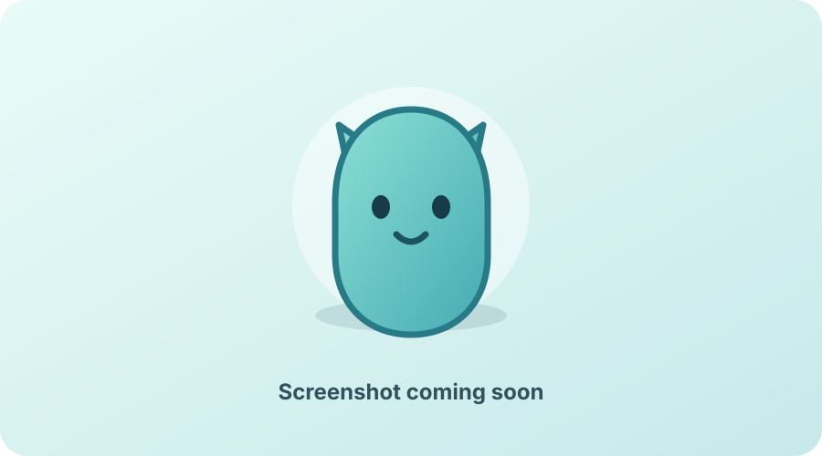

# Wellness Pet

Wellness Pet is a tiny animated macOS companion that nudges you to drink water and stand up at configurable intervals. The friendly interface is React; the actual reminder engine is Rust.



> A real application screenshot will replace this placeholder after the first tagged release.

## Why this project exists

Long focus sessions make healthy habits surprisingly easy to miss. Wellness Pet keeps those prompts local, lightweight, and pleasant. It is also an open-source portfolio project and a practical tour through Rust ownership, enums, error handling, persistence, concurrency, and desktop integration.

The differentiator is architectural: Rust is not decorative Tauri boilerplate. It owns reminder truth, validation, scheduling, quiet hours, persistence, lifecycle recovery, and duplicate prevention. React only presents snapshots and sends typed actions.

## Features

- Independent water and standing intervals
- Done, Snooze, and Skip actions
- Overnight quiet hours with local-time and daylight-saving handling
- Absolute timestamp scheduling that recovers after sleep without reminder backlogs
- One native notification attempt and one frontend event per due occurrence
- Sequential presentation when both reminders are overdue
- Pause/resume, always-on-top, and opt-in launch at login
- Transparent, borderless, draggable pet window with remembered on-screen position
- Menu-bar controls that can always show, hide, pause, resume, or quit
- Original inline-SVG pet with idle, water-due, stand-due, snoozed, celebrating, and paused states
- Local-only, versioned, crash-resistant JSON persistence

## Technology

- Tauri 2 and Rust
- React 19, TypeScript, and Vite
- Official Tauri notification and autostart plugins
- Vitest and React Testing Library
- Cargo unit and integration tests

## Architecture

```text
React UI
  │ typed commands + snapshot events
  ▼
Rust application service
  │ serializes state transitions
  ▼
Pure reminder domain ──► atomic local persistence
  │
  └──► notifications, tray, autostart, and window integration
```

The scheduler wakes every 15 seconds, evaluates wall-clock timestamps, persists any transition, and then publishes notifications/events. Focus and event-loop resume trigger the same evaluation path, so correctness does not depend on a mounted React component or punctual timer ticks. See [ARCHITECTURE.md](ARCHITECTURE.md) for details.

## Prerequisites

- macOS 10.15 or newer
- Apple Command Line Tools: `xcode-select --install`
- Node.js 22.12 or newer and npm
- Stable Rust with `rustfmt` and `clippy`

Follow the current [Tauri prerequisite guide](https://v2.tauri.app/start/prerequisites/) if your environment differs.

When Rust was installed through Homebrew's keg-only `rustup` formula, expose its commands in the current terminal session before running Cargo or Tauri:

```bash
export PATH="$(brew --prefix rustup)/bin:$PATH"
```

This project does not modify shell startup files automatically.

## Develop

```bash
npm install
npm run tauri dev
```

Useful validation commands:

```bash
npm run lint
npm test
npm run build
cargo fmt --check --manifest-path src-tauri/Cargo.toml
cargo clippy --manifest-path src-tauri/Cargo.toml --all-targets --all-features -- -D warnings
cargo test --manifest-path src-tauri/Cargo.toml
cargo check --manifest-path src-tauri/Cargo.toml
```

Build an unsigned local macOS bundle with:

```bash
npm run tauri build
```

## macOS distribution note

The transparent window uses Tauri's `macOSPrivateApi` option. This supports the intended direct GitHub distribution model, but applications using private macOS APIs are not eligible for the Mac App Store. A production release should be signed and notarized for smooth direct installation; pull-request CI intentionally performs unsigned validation only.

## Privacy

Wellness Pet has no accounts, telemetry, advertising, analytics, cloud backend, or remote artwork. Settings and reminder timestamps remain in the operating system's local application-data directory. Native notification and launch-at-login behavior use operating-system facilities and are optional.

## Contributing

Read [AGENTS.md](AGENTS.md) and [ARCHITECTURE.md](ARCHITECTURE.md), create a focused branch, add deterministic tests for behavioral changes, run the full validation suite, and open a pull request. Keep domain behavior in Rust and presentation behavior in React.

## Roadmap

- Replace the screenshot placeholder and polish the original application icon
- Add signed and notarized macOS releases with a polished DMG installer
- Validate Windows and Linux window/tray behavior
- Add more original pet themes without changing the reminder architecture
- Improve accessibility with optional reduced-animation presets

## License

MIT. See [LICENSE](LICENSE).
